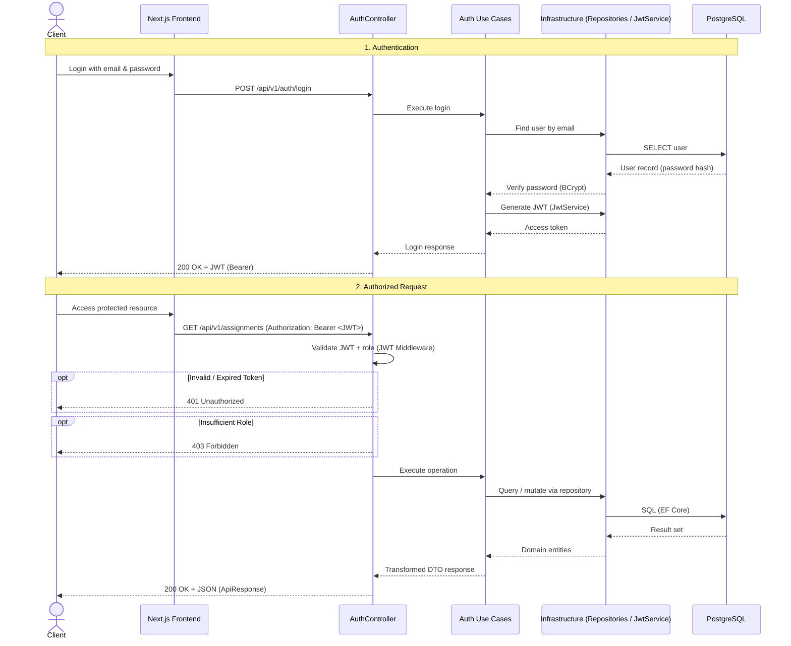
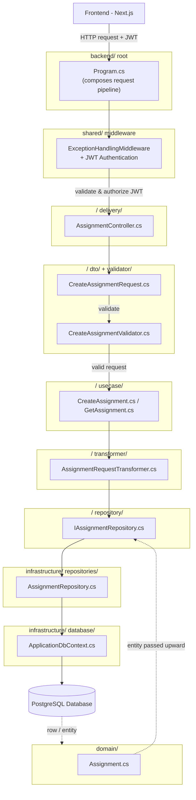

# Assignment Management API (Backend)

ASP.NET Core Web API (.NET 9) backend for the Assignment & Submission Management System.

## Project Structure

```text
backend/
├── domain/                      # Business entities
├── assignment/                  # Assignment feature module
├── teacher/                     # Teacher feature module
├── student/                     # Student feature module
├── course/                      # Course feature module
├── submission/                  # Submission feature module
├── auth/                        # Authentication feature module
├── infrastructure/              # Persistence, repositories, authentication, DI
│   ├── database/
│   │   ├── configurations/
│   │   └── migrations/
│   ├── repositories/
│   └── authentication/
├── shared/                      # Cross-cutting concerns
│   ├── exceptions/
│   ├── middleware/
│   ├── responses/
│   ├── constants/
│   ├── extensions/
│   └── utilities/
├── tests/
│   ├── unit/
│   └── integration/
├── deployment/
├── AssignmentManagement.sln
├── AssignmentManagement.Api.csproj
└── Program.cs
```

Each feature module follows the same layout: `usecase/`, `repository/`, `delivery/`, `transformer/`, `dto/`, `validator/`.

## Data Flow with Authentication



## Request Flow (Folder Structure)


---
