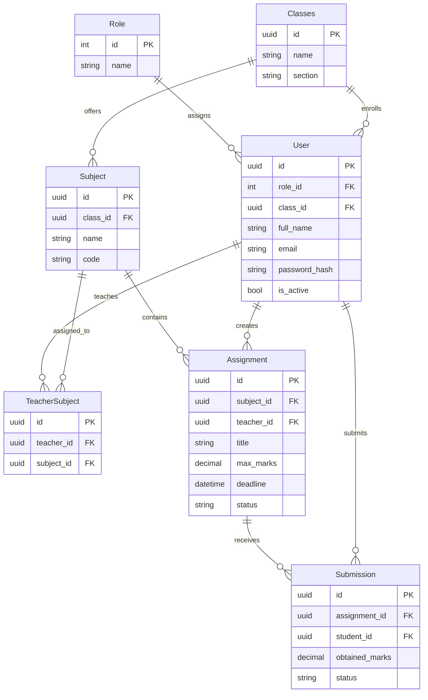
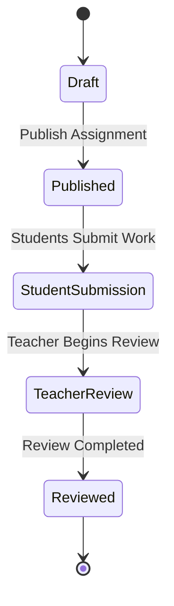

# Database Design

## 1. Database Overview

The **Assignment & Submission Management System** uses **PostgreSQL 16** as its relational database. The schema is designed to ensure data integrity, maintain consistency through relational constraints, and efficiently support assignment creation, submission, and evaluation workflows.

The database follows a normalized relational model with Role-Based Access Control (RBAC), soft deletion for business entities, and UUID-based primary keys to improve scalability and security.


## 2. Design Principles

- **ACID Compliance:** Ensures reliable transaction processing.
- **Third Normal Form (3NF):** Minimizes data redundancy.
- **Role-Based Access Control (RBAC):** Enforces secure access based on user roles.
- **Soft Deletion:** Preserves historical records without physical deletion.
- **Audit Fields:** Tracks creation and modification timestamps.
- **UUID Primary Keys:** Prevents predictable record enumeration.


## 3. Entity List

*(i)* **User:** Stores user account information including administrators,teachers, and students.

*(ii)* **Role:** Defines available system roles.
  - Admin
  - Teacher
  - Student

*(iii)* **Class:** Represents an academic class (e.g., Grade 10, Section A).

*(iv)* **Subject:** Represents a subject taught within a class.

*(v)* **TeacherSubject:** Maps teachers to the subjects they teach.

*(vi)* **Assignment:** Stores assignment information created by teachers.

*(vii)* **Submission:** Stores assignment submissions made by students together with marks and teacher feedback.


## 4. Entity Relationship Diagram



## 5. Table Schema

### Users :

| Column | Type | Constraints | Description |
| :--- | :--- | :--- | :--- |
| id | UUID | PK, Default: gen_random_uuid() | Primary key |
| role_id | INT | FK → Roles(id), NOT NULL | User role |
| class_id | UUID | FK → Classes(id), NULL | Student's class |
| email | VARCHAR(255) | NOT NULL, UNIQUE | Login email |
| password_hash | VARCHAR(255) | NOT NULL | BCrypt hashed password |
| full_name | VARCHAR(100) | NOT NULL | User full name |
| is_active | BOOLEAN | DEFAULT TRUE | Account status |
| is_deleted | BOOLEAN | DEFAULT FALSE | Soft delete flag |
| created_at | TIMESTAMPTZ | DEFAULT CURRENT_TIMESTAMP | Creation timestamp |
| updated_at | TIMESTAMPTZ | NULL | Last update timestamp |


### Roles :

| Column | Type | Constraints | Description |
| :--- | :--- | :--- | :--- |
| id | INT | PK | Role ID |
| name | VARCHAR(50) | UNIQUE | Role name |


### Classes :

| Column | Type | Constraints | Description |
| :--- | :--- | :--- | :--- |
| id | UUID | PK | Primary key |
| name | VARCHAR(100) | NOT NULL | Class name |
| section | VARCHAR(20) | NULL | Section |
| is_deleted | BOOLEAN | DEFAULT FALSE | Soft delete |
| created_at | TIMESTAMPTZ | DEFAULT CURRENT_TIMESTAMP | Creation timestamp |


### Subjects :

| Column | Type | Constraints | Description |
| :--- | :--- | :--- | :--- |
| id | UUID | PK | Primary key |
| class_id | UUID | FK → Classes(id) | Parent class |
| name | VARCHAR(100) | NOT NULL | Subject name |
| code | VARCHAR(20) | NULL | Subject code |
| is_deleted | BOOLEAN | DEFAULT FALSE | Soft delete |
| created_at | TIMESTAMPTZ | DEFAULT CURRENT_TIMESTAMP | Creation timestamp |


### TeacherSubjects :

| Column | Type | Constraints | Description |
| :--- | :--- | :--- | :--- |
| id | UUID | PK | Primary key |
| teacher_id | UUID | FK → Users(id) | Assigned teacher |
| subject_id | UUID | FK → Subjects(id) | Assigned subject |
| created_at | TIMESTAMPTZ | DEFAULT CURRENT_TIMESTAMP | Mapping timestamp |


### Assignments :

| Column | Type | Constraints | Description |
| :--- | :--- | :--- | :--- |
| id | UUID | PK | Primary key |
| subject_id | UUID | FK → Subjects(id) | Related subject |
| teacher_id | UUID | FK → Users(id) | Assignment creator |
| title | VARCHAR(200) | NOT NULL | Assignment title |
| description | TEXT | NOT NULL | Assignment instructions |
| max_marks | DECIMAL(5,2) | NOT NULL | Maximum marks |
| deadline | TIMESTAMPTZ | NOT NULL | Submission deadline |
| status | VARCHAR(20) | DEFAULT 'Draft' | Draft / Published / Closed |
| is_deleted | BOOLEAN | DEFAULT FALSE | Soft delete |
| created_at | TIMESTAMPTZ | DEFAULT CURRENT_TIMESTAMP | Creation timestamp |
| updated_at | TIMESTAMPTZ | NULL | Last update timestamp |


### Submissions :

| Column | Type | Constraints | Description |
| :--- | :--- | :--- | :--- |
| id | UUID | PK | Primary key |
| assignment_id | UUID | FK → Assignments(id) | Parent assignment |
| student_id | UUID | FK → Users(id) | Submitted by |
| submission_text | TEXT | NULL | Student response |
| attachment | VARCHAR(500) | NULL | Attachment URL/path |
| status | VARCHAR(20) | DEFAULT 'Submitted' | Submitted / Reviewed |
| obtained_marks | DECIMAL(5,2) | NULL | Awarded marks |
| teacher_feedback | TEXT | NULL | Teacher feedback |
| reviewed_at | TIMESTAMPTZ | NULL | Review timestamp |
| created_at | TIMESTAMPTZ | DEFAULT CURRENT_TIMESTAMP | Submission timestamp |
| updated_at | TIMESTAMPTZ | NULL | Last update timestamp |


## 6. Primary Keys & Foreign Keys

### Primary Keys :

- UUID (Version 4) is used for all business entities.
- Roles use integer primary keys for simplicity.

### Foreign Keys :

- Users.role_id → Roles.id
- Users.class_id → Classes.id
- Subjects.class_id → Classes.id
- TeacherSubjects.teacher_id → Users.id
- TeacherSubjects.subject_id → Subjects.id
- Assignments.subject_id → Subjects.id
- Assignments.teacher_id → Users.id
- Submissions.assignment_id → Assignments.id
- Submissions.student_id → Users.id

## 7. Constraints

### Composite Unique Constraints :

- **Users(email)**: Prevents duplicate user accounts.
- **TeacherSubjects(teacher_id, subject_id)**: Prevents assigning the same teacher to the same subject multiple times.
- **Submissions(assignment_id, student_id)**: Ensures a student can submit only once per assignment.
- **Assignments(subject_id, title)**: Prevents duplicate assignment titles within the same subject.


### Check Constraints :

- `Assignments.max_marks > 0`
- `Assignments.deadline > CURRENT_TIMESTAMP`
- `Submissions.obtained_marks >= 0`


## 8. Indexing Strategy

The following indexes optimize common filtering, searching, and relationship queries.

### Unique Indexes :

- `Users(email)`
- `TeacherSubjects(teacher_id, subject_id)`
- `Submissions(assignment_id, student_id)`


### Foreign Key Indexes :

- `Users(role_id)`
- `Users(class_id)`
- `Subjects(class_id)`
- `TeacherSubjects(teacher_id)`
- `TeacherSubjects(subject_id)`
- `Assignments(subject_id)`
- `Assignments(teacher_id)`
- `Submissions(assignment_id)`
- `Submissions(student_id)`


### Search & Filter Indexes

- `Assignments(status)`
- `Assignments(deadline)`
- `Submissions(status)`


## 9. Cascade Rules

- **ON DELETE RESTRICT**
  - Roles → Users
  - Classes → Users
  - Classes → Subjects
  - Subjects → Assignments
  - Users → Assignments
  - Assignments → Submissions
  - Users → Submissions

- **ON DELETE CASCADE**
  - TeacherSubjects (mapping records)


## 10. Soft Delete Strategy

The following entities use soft deletion:

- Users
- Classes
- Subjects
- Assignments

Entity Framework Core Global Query Filters are used to automatically exclude deleted records.

```csharp
builder.Entity<Assignment>()
    .HasQueryFilter(a => !a.IsDeleted);
```


## 11. Naming Conventions

### Tables :

- PascalCase
- Singular table names

Examples:

- User
- Role
- Class
- Subject
- Assignment
- Submission


### Columns :

- snake_case

- Examples:
  - created_at
  - updated_at
  - password_hash
  - obtained_marks


### Primary Keys :

- `id`

### Foreign Keys :

- `<entity>_id`

- Examples
  - role_id
  - class_id
  - subject_id
  - teacher_id
  - assignment_id


## 12. Timestamp Convention

All timestamps:
- Use UTC
- Use `TIMESTAMPTZ`
- Generated by the database

Standard timestamp fields:
- created_at
- updated_at
- reviewed_at


## 13. Enumerations

### Roles:

- Admin
- Teacher
- Student


### Assignment Status:

- Draft
- Published
- Closed

### Submission Status:

- Submitted
- Reviewed


## 14. Entity Lifecycle




## 15. Future Improvements

- Refresh Token support
- File storage integration (AWS S3 / Azure Blob)
- Audit logging
- Background job processing
- Redis caching
- Email notifications
- API versioning
- Assignment analytics dashboard
